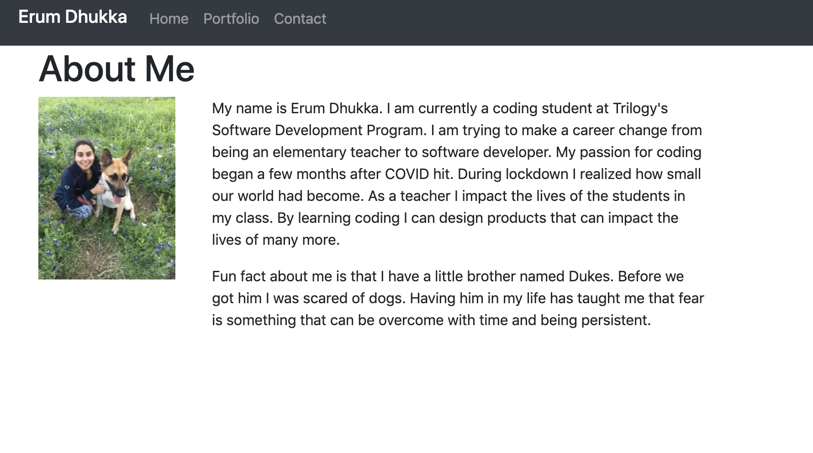

# Responsive Portfolio
Responsive Portfolio

I used a responsive design to make sure webpage loads on different devices of different screen sizes.  This included having working link to different pages on the same web browser. I also made sure images loaded fully.  

I used Bootstrap CSS framework to create portfolio and Visual Studio Tool.  

https://github.com/erumd/Bootstrap-Portfolio

https://erumd.github.io/Bootstrap-Portfolio/.

<h4> Webpage View </h4>>

<h4> Small Screen View </h4>>

