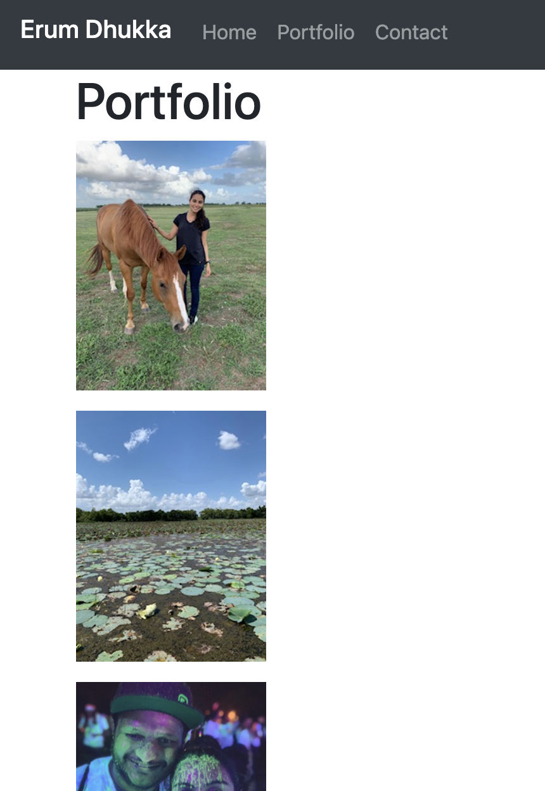
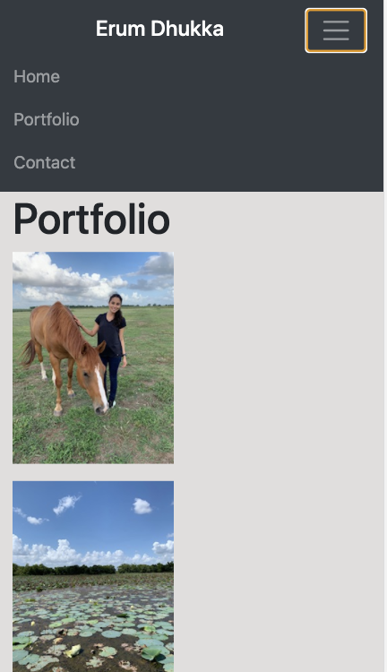
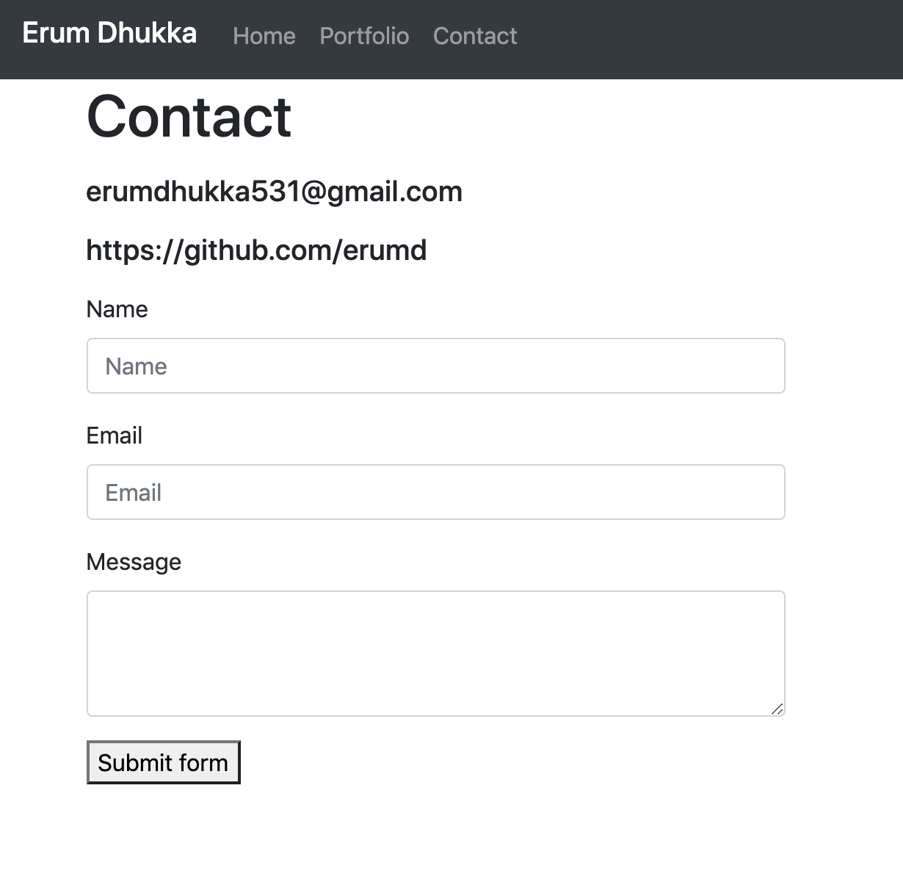
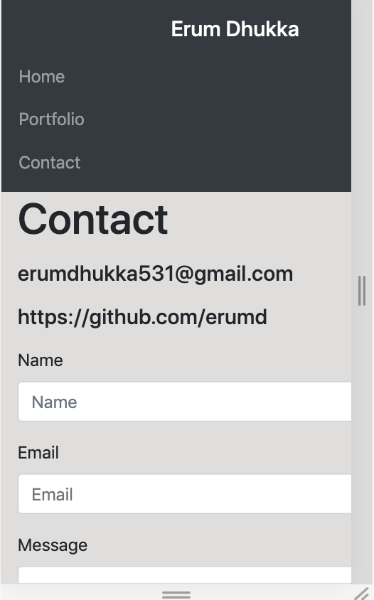

<h1>Responsive Portfolio</h1>

I used a responsive design to make webpage that loads on different devices of different screen sizes.  This included having working link to different pages on the same web browser. I also made sure images loaded fully. I used Bootstrap CSS framework to create portfolio and Visual Studio Tool.  

https://github.com/erumd/Bootstrap-Portfolio

https://erumd.github.io/Bootstrap-Portfolio/.

<h1> Screenshots of My Webpage </h1>
<h2> "About Me" Webpage View </h2>

<h2> "About Me" Small Screen View </h3>

<h2> "Portfolio" Webpage View </h2>

<h3> "Portfolio" Small Screen View </h3>

<h2> "Contact" Webpage View </h2>

<h3> "Contact" Small Screen View </h3>
